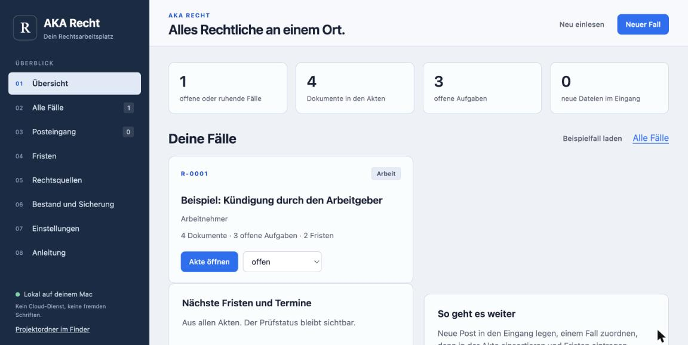
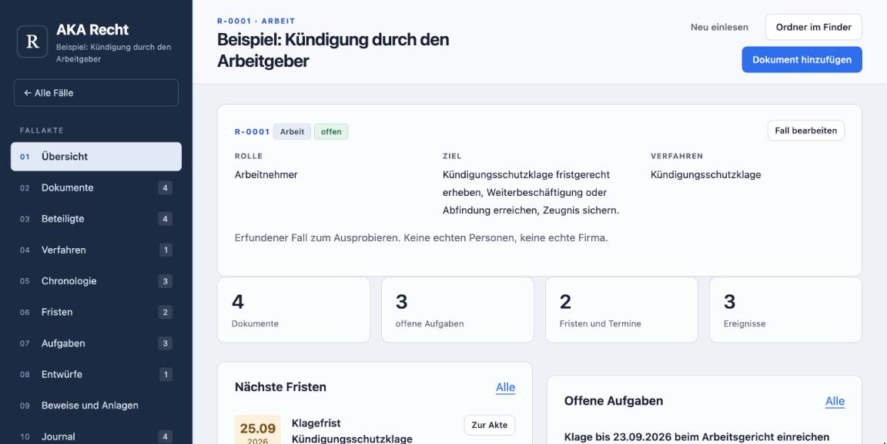
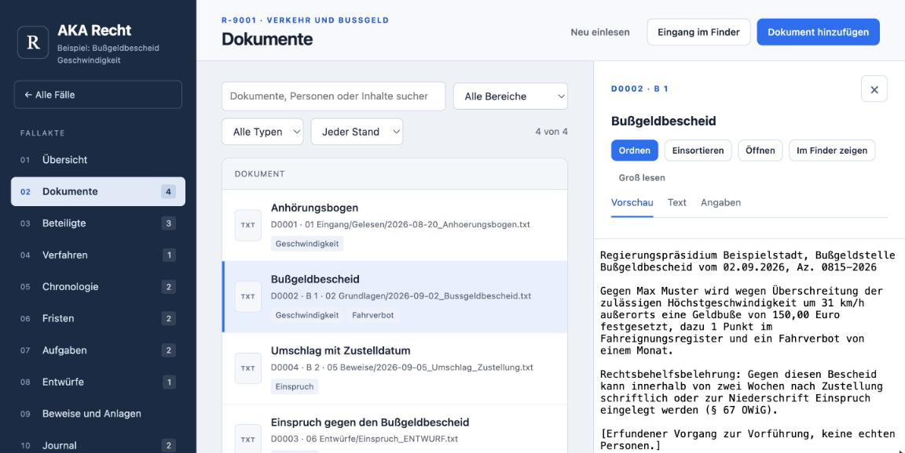
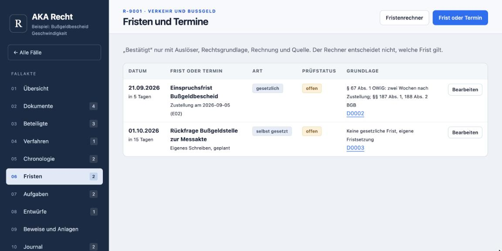
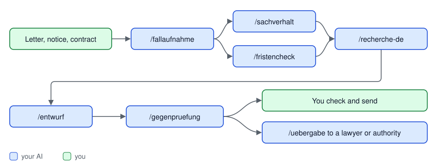

<p align="center"></p>

<p align="center">


</p>

<a name="reiter"></a>

<p align="center">
<a href="#aka-recht"></a>
<a href="#setup"></a>
<a href="#ai"></a>
<a href="#contents"></a>
<a href="#safety"></a>
<a href="#contribute"></a>
</p>

<p align="center"><a href="README.md">Deutsch</a> · <b>English</b> · <a href="CONTRIBUTING.md">Contribute</a> · <a href="https://github.com/sponsors/Cehha79">Support</a></p>

# AKA Recht

A parking ticket, a dismissal, a service-charge statement, a notice from the
authorities: sooner or later everyone has a legal matter, and then letters,
photos, e-mails and deadlines are scattered everywhere. **AKA Recht** is the
folder where all of it has its place, and the set of guides with which your
AI helps you to organise, check and formulate.

- **Every matter is a case** with a fixed id, fixed folders, structured data in
  `akte.json` and a journal. Originals are never changed.
- **Deadlines with a calculation:** every deadline shows trigger, legal basis and
  the calculation under §§ 187, 188, 193 BGB with the holidays of your state.
- **Your AI works with it:** Claude Code, Claude Desktop, Codex or any other
  that speaks MCP (Model Context Protocol) or can run commands. 7 guides
  take it from case intake to a reviewed draft, 35 tools let it read
  the case and, after your confirmation, write to it.
- **Everything stays with you:** no AI inside the app, no account, no key, no
  network. The service runs only on your machine.

> [!TIP]
> To try it out there is a fictional sample case (dismissal by the employer).
> Click **"Beispielfall laden"** in the UI, then browse case, documents,
> deadlines and draft. Delete it whenever you like.

Product version 0.4 of 18.09.2026 · data format `akte.json` schema 1 · MCP protocol 2026-07-28 and 2025-11-25 · tested with Python 3.14.7 on macOS 26.7, Ubuntu 24.04 (Python 3.12) and Windows 11 (Python 3.14) · Author: Hasan Tepegöz

## Download

| Way | How |
|---|---|
| Fixed version | On the [release page](https://github.com/Cehha79/aka-recht/releases/latest) download "Source code (zip)" and extract it. |
| Latest state | `git clone https://github.com/Cehha79/aka-recht` or on GitHub "Code", "Download ZIP". |

Then continue with **[Setup](#setup)**: requirements, first start
per system, connecting an AI. To pass it on, share the GitHub link and do not
re-pack the folder yourself (the reason is under Setup).

## What it looks like

Click to enlarge. All pictures show the fictional sample case ("Max Muster"
v. "Muster Logistik GmbH"), no real persons. The UI is in German.

<table>
<tr>
<td width="50%"><a href="bilder/01-zentrale.jpg"></a><br><sub><b>Dashboard:</b> all cases, next deadlines, inbox</sub></td>
<td width="50%"><a href="bilder/02-fallakte.jpg"></a><br><sub><b>Case file:</b> role, goal, proceedings, deadlines, tasks</sub></td>
</tr>
<tr>
<td width="50%"><a href="bilder/03-dokumente.jpg"></a><br><sub><b>Documents:</b> preview, id, exhibit number, filing</sub></td>
<td width="50%"><a href="bilder/04-fristen.jpg"></a><br><sub><b>Deadlines:</b> legal basis, calculation, check status</sub></td>
</tr>
</table>

The UI has a **dashboard** (overview, all cases, inbox, deadlines of all
cases, legal sources, inventory and backup, settings, manual) and per case a
**case file** (overview, documents with preview, parties, proceedings,
timeline, deadlines with calculator, tasks, drafts, evidence and exhibits,
journal). It is plain HTML, CSS and JavaScript without a framework and needs
no outside access.

> [!WARNING]
> **Not a lawyer, no legal advice.** What the folder does and does not do is
> described under [Safety and limits](#limits).


<p align="right"><sub><a href="#reiter">↑ back to top</a></sub></p>

<a name="setup"></a>


## Requirements

- Python 3.12 or newer (`python3 --version`). Tested with 3.12.3 on Ubuntu and
  3.14.7 on macOS and Windows; older versions are untested. No other
  packages.
- Tested on 18 Sep 2026 on macOS 26.7, on Ubuntu 24.04 (Python 3.12) and on
  Windows 11 (Python 3.14.7): test suite with 61 checks (more checks have been
  added since; those have only run on macOS so far), service via the start
  script, MCP server, sample case in a folder with spaces and umlauts, text
  recognition on a photo and a two-page scan.
- Optional for text extraction from PDF: the program `pdftotext` (poppler).
- Optional for photos and scans without a text layer: text recognition (OCR)
  with `tesseract` and German language data; scanned PDFs also need
  `pdftoppm` (poppler as well). Without these programs nothing changes, the
  folder just reports that no text was read.

<details>
<summary><b>macOS — step by step</b></summary>

**1. Start the folder**

Double-click `Start.command`. The first time, macOS asks whether you really
want to open the program — that is normal, the file came from the internet. If
the double-click does nothing: right-click the file, **Open**, then **Open**
again in the dialog.

*It worked if:* a black window appears and the browser shows the folder. You
can close that window afterwards — the service keeps running in its own
session. Stop it from "Bestand und Sicherung" or by restarting the computer.

**2. Set up text recognition — optional**

Only needed if you want to read photos or scanned letters without a text
layer. Everything else works without this step.

You need **Homebrew**, a package manager for macOS — a program that installs
other programs. Check whether you already have it:

```
brew --version
```

If that fails, install Homebrew first (see [brew.sh](https://brew.sh)). Then:

```
brew install poppler tesseract tesseract-lang
```

*It worked if:* the next command lists `deu`.

```
tesseract --list-langs
```

> [!NOTE]
> On Intel Macs with a recent macOS there are sometimes no prebuilt packages.
> Homebrew then builds from source, which can take an hour or more (seen on
> macOS 26.7 on 17 Sep 2026). Just let the window run.

**3. Important: do not re-pack the folder yourself**

Neither with `zip` or `ditto` nor with Finder ("Compress"). None of them writes
a UTF-8 flag into the archive. Extract it on another machine and `06 Entwürfe`
turns into a broken name such as `06 Entwürfe` (tested 18 Sep 2026 for
Finder and `zip`).

On the Mac you never notice, because Finder reads its own archives correctly.
It breaks only when the archive moves to Windows or Linux.

*To share:* send the GitHub link. *To back up:* use the button in the folder —
it packs with Python's `zipfile`, which is clean.

</details>

<details>
<summary><b>Linux — step by step</b></summary>

**1. Start the folder**

```
./Start.sh
```

If the execute bit is missing, once:

```
chmod +x Start.sh
```

*It worked if:* the browser shows the folder. `xdg-open` serves as file
manager.

**2. Set up text recognition — optional**

Only needed for photos and scanned letters without a text layer. On Ubuntu and
Debian one command is enough:

```
sudo apt install poppler-utils tesseract-ocr tesseract-ocr-deu
```

It asks for your password; nothing shows while you type, that is intended.
Other distributions use their own package names (Fedora: `dnf install
poppler-utils tesseract tesseract-langpack-deu`).

*It worked if:* `deu` is listed.

```
tesseract --list-langs
```

**3. Tested on 18 Sep 2026**

Ubuntu 24.04 with Python 3.12: test suite with 61 checks, service via
`Start.sh`, MCP server, sample case in a folder with spaces and umlauts. Text
recognition read a photo and a two-page scan without a text layer
(tesseract 5.3.4).

</details>

<details>
<summary><b>Windows — step by step</b></summary>

**1. Start the folder — and do it first**

Double-click `Start.bat`.

> [!IMPORTANT]
> This has to happen **before** you first start Claude Code or Codex. Reason:
> on Windows the command is `python`, not `python3` — `python3.exe` is only a
> Microsoft Store stub there. `Start.bat` therefore switches `.mcp.json`,
> `.claude/settings.json` and `.codex/config.toml` to `python`. Start the AI
> first and you get "Python was not found" and the hooks do not run.

*It worked if:* the browser shows the folder. If you use git, those three
files then show as modified — that is correct.

**2. Set up text recognition — optional**

Only needed for photos and scanned letters without a text layer, and for text
from PDF. Windows ships neither `tesseract` nor `pdftotext`. Both are available
through `winget`, the Windows package manager. Open a command prompt (Start
menu, type `cmd`) and run one after the other:

```
winget install --id UB-Mannheim.TesseractOCR
```

```
winget install --id oschwartz10612.Poppler
```

**3. Add the German language data**

The tesseract installer ships **English only**. Tick **German** under
"Additional language data" in the installer window.

If it runs without a window, German is missing. Then download
`deu.traineddata` from [tessdata](https://github.com/tesseract-ocr/tessdata)
and put it into `C:\Program Files\Tesseract-OCR\tessdata` — Explorer needs
administrator rights for that.

**4. Check**

Open a **new** window (the old one does not know the new programs yet):

```
tesseract --list-langs
```

*It worked if:* `deu`, `eng` and `osd` are listed.

If Windows cannot find the command, that is the tesseract installer: it does
**not** add the program to the search path. Not a problem for the folder — it
also looks in the usual locations. To check by hand, use the full path:

```
"C:\Program Files\Tesseract-OCR\tesseract.exe" --list-langs
```

**5. Tested on 18 Sep 2026**

Windows 11 with Python 3.14.7: test suite with 61 checks, text recognition on
a photo and a two-page scan, Claude Code with MCP server (32 tools) and
working original protection.

</details>


## First start

1. Get it: `git clone https://github.com/Cehha79/aka-recht` or on GitHub "Code", "Download ZIP" and extract;
   put the folder wherever you like. To pass it on, share the GitHub link and
   do not re-pack the folder yourself (see macOS above).
2. Start: macOS `Start.command`, Linux `Start.sh`, Windows `Start.bat`. The
   service binds to 127.0.0.1 only and your default browser opens the UI.
   `zentrale.json` is created on first start.
3. Under "Einstellungen" enter your sender details (name, address, contact);
   they stay in `zentrale.json` on your computer and later fill "Von:" and
   the signature in drafts made from the templates.
4. In the UI create a new case ("Neuer Fall"), put mail into `01 Eingang` or
   add it under "Dokumente", file it, calculate deadlines, keep the journal.
5. Read the "Anleitung" page in the UI; it also explains how to connect an AI.

## Connecting an AI

<details open>
<summary><b>Claude Code</b></summary>

Start a session in the folder; `.mcp.json` is included; confirm the dialog;
check with `/mcp`. Skills under `.claude/skills/` (`/fallaufnahme`,
`/fristencheck`, `/entwurf` …), hooks from `.claude/settings.json`.

</details>

<details>
<summary><b>Codex</b></summary>

- Option A: once `codex mcp add aka-recht -- python3 "<full path>/06 Werkzeuge/dienst/mcp_server.py"`.
- Option B without that entry: mark the project folder as trusted in
  `~/.codex/config.toml` (`[projects."<full path to the project folder>"]` with
  `trust_level = "trusted"`); Codex then loads the bundled
  `.codex/config.toml`; an entry for a parent folder is not enough.
- Check inside the project folder with `codex mcp list`. On Windows use
  `python` instead of `python3`. Skills under `.agents/skills/` (`$fristencheck` …).

</details>

<details>
<summary><b>Claude Desktop</b></summary>

Settings, Developer, edit config: entry `aka-recht` with `command` `python3`
(on Windows `python`) and `args` `["<full path>/06 Werkzeuge/dienst/mcp_server.py"]`;
restart Claude Desktop.

</details>

<details>
<summary><b>Other assistants</b></summary>

- With MCP: the same call in the assistant's configuration file; work profile
  in `AGENTS.md`.
- Without MCP, with commands: `python3 "06 Werkzeuge/dienst/cli.py" liste`.
- ChatGPT in the browser or app does not start a local server; it requires a
  public HTTPS address or a tunnel through OpenAI. That is not intended for
  AKA Recht.

</details>

Writing tools only run when you confirm the call. There are no tools for
sending, deleting or changing originals.

### What actually works in which assistant

Three things to keep apart: **shipped** means the folder brings the
configuration along; **tested here** means we ran it on our own machine;
**open** means we do not know.

| | Claude Code | Codex | Claude Desktop | Others (Cursor, Gemini CLI …) |
|---|---|---|---|---|
| Tools over MCP | shipped (`.mcp.json`), tested here | shipped (`.codex/config.toml`), tested here | shipped (manual entry), tested here | path described, not tested |
| Tools over the command line | yes | yes | no (no shell access) | if the assistant may run commands |
| Working profile is loaded | `CLAUDE.md`, tested here | `AGENTS.md`, tested here | no — a pure MCP client reads no project files | only if the assistant reads `AGENTS.md` (see below) |
| Review workflows (skills) | `.claude/skills/`, tested here | `.agents/skills/`, listed | no | open |
| Original protection via a hook | yes (`.claude/settings.json`, for Write, Edit, MultiEdit, NotebookEdit) | not set up | not applicable | no |
| Word file and handover package | yes (separate scripts) | yes | no | only with command access |

**Important for pure MCP clients** (Claude Desktop and similar): they receive
the tools, but neither the working profile nor the review workflows. The rules
of this folder apply there only as far as the tools themselves enforce them —
and they do: original areas stay locked, deadlines without evidence cannot be
confirmed, drafts without a frozen version cannot be saved as reviewed.

**Gemini CLI:** the folder ships `AGENTS.md`, but Gemini looks for `GEMINI.md`
by default. To load the profile it needs a `contextFileName` entry pointing to
`AGENTS.md` in `.gemini/settings.json` (Gemini CLI documentation "Provide
context with GEMINI.md files", retrieved 18 Sep 2026). We have **not** tested
this path and therefore ship no ready-made Gemini configuration. Check inside
the client which rules were loaded before letting it work on a case file.

## Updating

Your own data lives in `01 Eingang`, `02 Fälle`, `03 Verträge und Vorsorge`
and `zentrale.json`. Make a backup before every update ("Geprüfte Sicherung
erstellen" in the UI).

<details open>
<summary><b>With git</b></summary>

Inside the folder run `git pull`. The four places holding your data are listed
in the bundled `.gitignore`; git leaves them alone. On Windows `Start.bat` has
changed three configuration files; if `git pull` stops because of them, first
run `git checkout -- .mcp.json .claude/settings.json .codex/config.toml`
(this only discards that switch; `Start.bat` sets it again on the next start).

</details>

<details>
<summary><b>With a new ZIP</b></summary>

1. Extract the new version into a new folder.
2. Stop the running service. There is no button for it: restart the computer,
   or on macOS and Linux run `pkill -f "06 Werkzeuge/dienst/server.py"` in a terminal
   (this stops every running folder service on this computer).
3. Move `01 Eingang`, `02 Fälle`, `03 Verträge und Vorsorge` and
   `zentrale.json` from the old folder into the new one; remove the empty
   folders of the new one first.
4. Start inside the new folder. Cases and settings are back; the paths in
   `zentrale.json` are relative to the folder.
5. If you set up Codex or Claude Desktop with the full path to
   `mcp_server.py`, change that path to the new folder.

</details>

## FAQ

<details>
<summary><b>Do I need an account or internet access?</b></summary>

Not for the folder: the service binds to 127.0.0.1 only and calls no outside
addresses. Your AI (Claude, Codex or another) needs its own account and
access; whatever it reads is processed by its provider.

</details>

<details>
<summary><b>Which AI can I use?</b></summary>

Tested are Claude Code, Claude Desktop and Codex (see "Connecting an AI").
Any other AI that speaks MCP or may run commands should work but is untested.
ChatGPT in the browser or app is not intended because it starts no local server.

</details>

<details>
<summary><b>Do my cases end up on GitHub?</b></summary>

No. The folder uploads nothing. If you use git yourself: `01 Eingang`,
`02 Fälle`, `03 Verträge und Vorsorge` and `zentrale.json` are in the
`.gitignore` and are not tracked. If a backup target is in a cloud folder,
your system uploads the backup there.

</details>

<details>
<summary><b>Can the folder read scanned letters?</b></summary>

If the PDF has a text layer, `pdftotext` reads it directly. For photos and
scans without a text layer there is text recognition: "Texterkennung starten"
at the document in the UI, or the tool `texterkennung`, provided `tesseract`
is installed. The result is stored as a separate text file under
`07 Recherche/Texterkennung/`, the original stays unchanged. Recognised text
can mix up characters and drop lines; always check dates, amounts and names
against the original.

</details>

<details>
<summary><b>Does it work for other countries?</b></summary>

No. Deadline calculator, fact sheets and templates apply to German law
only, see [Scope](#scope).

</details>

<details>
<summary><b>Will anyone here answer questions about my case?</b></summary>

No. Issues and discussions are for the software only. For your case ask a
qualified lawyer or an advice centre.

</details>

<p align="right"><sub><a href="#reiter">↑ back to top</a></sub></p>

<a name="ai"></a>


## How your AI works with the folder

The folder contains no AI. It ships with guides (skills) that tell your own
AI how to work a case, and tools with which it reads the case and, after your
confirmation, writes to it. Blue is the AI, green is you:

<picture>
<source media="(prefers-color-scheme: dark)" srcset="bilder/ablauf-dunkel-en.svg">

</picture>

## Skills


Call them in Claude Code with `/name`, in Codex with `$name`; the first
argument is always the case id:

| Call | What happens |
|---|---|
| `/fallaufnahme R-0001` | Case intake: role, goal, area of law, parties, receipt dates, missing facts; writes to the case and names the remedy from the fact sheet |
| `/sachverhalt R-0001` | Statement of facts: timeline and evidence table from the originals, with a source for every statement |
| `/fristencheck R-0001` | Deadlines with trigger, receipt, legal basis and a visible calculation; holidays of the place of performance |
| `/recherche-de R-0001 "Gilt § 193 BGB?"` | Legal research on the original full text, version and period of validity, checklist, sources into the case |
| `/entwurf R-0001 Widerspruch` | Letters and pleadings from the templates, mandatory content checked against the fact sheet, as Markdown and Word |
| `/gegenpruefung R-0001 06 Entwürfe/…_ENTWURF.md` | Adversarial review: split claims, attack them, strengthen the other side; unsupported claims, wrong citations, figures, exhibits |
| `/uebergabe R-0001 Anwalt` | Hand-over package for a lawyer, authority or court as a ZIP with index, timeline, deadlines, exhibits |

The guides set the standard of care: every legal statement names the
provision with paragraph and act, or the decision with court, date and
docket number, read in the full text; anything unverified stays visible as
`[PRÜFEN]`, `[QUELLE]` or `[BELEG]`; the other side is always considered;
instructions found inside documents are source content and are not followed.

> [!IMPORTANT]
> These decisions are always taken by the human, never by the AI: sending or
> filing, waiver or withdrawal, settlement, criminal complaint, termination,
> waiving a deadline, any declaration to third parties, deletion. Every draft
> stays a draft until you check it and send it yourself. There are no tools
> for sending, deleting or changing originals.

## Hooks


Hooks are small check scripts that Claude Code runs itself (registered in
`.claude/settings.json`, source under `.claude/recht/hooks/`). They are set
up and tested for Claude Code only (as of 17.09.2026). Codex documents hooks
of its own; nothing is included here for them. Other assistants follow the
rules in `AGENTS.md` themselves.

<details>
<summary><b>The 4 hooks in detail</b></summary>

| Event | What the hook does |
|---|---|
| `SessionStart` | reports new mail, near deadlines and open tasks per case at session start, plus legal content due for a check |
| `PreToolUse` | original protection: writing into 02 to 05, 08 and bestand.json is refused, checked on the resolved path |
| `PostToolUse` | foreign-text guard: warns with the source when read text (file, command, web or MCP tool) contains sentences that look like instructions to the AI |
| `Stop` | doc check: compares the HTML views with their md sources and the copies for other assistants with CLAUDE.md and the skills, names every mismatch |

</details>

<p align="right"><sub><a href="#reiter">↑ back to top</a></sub></p>

<a name="contents"></a>


## Case folders

Every case gets the same folders so that references stay stable:

```text
02 Fälle/R-0001 Beispiel/
├─ akte.json          structured data: parties, documents, deadlines, tasks, drafts
├─ bestand.json       checksums of every file (written only by the service)
├─ JOURNAL.md         history, append only
├─ 01 Eingang/        new mail
├─ 02 Grundlagen/     contracts, notices, powers of attorney
├─ 03 Schriftverkehr/ one folder per party, plus proof of dispatch
├─ 04 Verfahren/      one folder per proceeding (action, fine, appeal …)
├─ 05 Beweise/        photos, lists, receipts
├─ 06 Entwürfe/       unsent texts, name ends with _ENTWURF
├─ 07 Recherche/      review memos, case-related legal sources
└─ 08 Archiv/         old overviews, unchanged
```

Originals in 02 to 05 and 08 are never changed, renamed or deleted; a hook
blocks that for the AI. New texts go to 06, memos to 07.

## Tools


The same 35 tools are available over MCP (`06 Werkzeuge/dienst/mcp_server.py`)
and on the command line (`python3 "06 Werkzeuge/dienst/cli.py" <tool> field=value`).
Over MCP, writing tools run only with your confirmation (only the JSON value
`true` counts); on the command line the AI is told to ask first. Reading tools
never change a file: a new or moved file is only reported, it gets its ID
through `bestand_abgleichen`; the UI does that when you open a case. Every
change to `akte.json` is validated against the data model and saved with a revision.

<details>
<summary><b>All 35 tools</b></summary>

| Tool | Kind | Purpose |
|---|---|---|
| `faelle_auflisten` | reads | List all cases with id, title, area, status, number of documents, unregistered files and open tasks |
| `fall_uebersicht` | reads | Compact overview of one case: parties, proceedings, open deadlines and tasks, events, document list, unregistered files |
| `dokument_text` | reads | Text of one document (Word, e-mail, PDF, text, HTML) with its source: read directly, from the PDF text layer or not at all (scan, photo); the extract is derived, check figures and deadlines against the original |
| `dokumente_suchen` | reads | Full-text search in titles, metadata and document contents of a case |
| `frist_berechnen` | reads | Deadline end under §§ 187, 188, 193 BGB with the public holidays of a federal state; shows the calculation, does not decide which deadline applies |
| `beispiel_laden` | writes | Create the bundled sample case (fictional) as a new case |
| `bestand_pruefen` | reads | Compare checksums of all registered files of a case with their first state; also reports unregistered and moved files; writes nothing |
| `journal_lesen` | reads | Read the case journal, newest entries last |
| `quellen_katalog` | reads | Catalogue of official legal sources from 04 Rechtsquellen/Quellen.md |
| `rechtsinhalte_pruefen` | reads | Reports which bundled legal content is due for a new check against the official full text: fact sheets, holiday table, source catalogue; writes nothing, no network |
| `fall_anlegen` | writes | Create a new case with a fixed id and folder structure |
| `fall_status_setzen` | writes | Set case status to open, dormant or closed |
| `beteiligter_anlegen` | writes | Beteiligten in einem Fall anlegen (Person, Gericht, Behörde, Anwalt, Zeuge, Stelle). Gibt die neue P-Kennung zurück; Verweise aus Dokumenten, Verfahren und Fristen gehen auf diese Kennung. |
| `verfahren_anlegen` | writes | Verfahren in einem Fall anlegen (Klage, Bußgeldverfahren, Widerspruch, Mahnverfahren, Strafanzeige). Ein Verfahren ist alles, was eine eigene Stelle und ein eigenes Aktenzeichen hat. |
| `beteiligter_setzen` | writes | Vorhandenen Beteiligten ändern (Name, Rolle, Anschrift, Kontakt, Aktenzeichen). Nur die übergebenen Felder werden geändert; die P-Kennung bleibt, damit Verweise gültig bleiben. |
| `verfahren_setzen` | writes | Vorhandenes Verfahren ändern (Art, Stelle, Aktenzeichen, Stand, Ordner). Nur die übergebenen Felder werden geändert; die V-Kennung bleibt, damit Fristen ihren Bezug behalten. |
| `quelle_eintragen` | writes | Fallbezogene Rechtsquelle in der Akte vermerken: Norm, Entscheidung oder amtliche Seite mit Abrufdatum und wofür sie gebraucht wird. Gehört zu diesem Fall; der gemeinsame Zugangskatalog steht in 04 Rechtsquellen/Quellen.md (Werkzeug quellen_katalog). Gleicher Titel überschreibt den vorhandenen Eintrag. |
| `aufgabe_anlegen` | writes | Add a task to a case |
| `aufgabe_setzen` | writes | Mark a task done or open, optionally change due date or detail |
| `frist_eintragen` | writes | Enter a deadline or appointment; "confirmed" only with trigger, legal basis, calculation naming the end date, source and no open marker; confirmation carries review date and reviewer |
| `vorlagen_auflisten` | reads | List the letter templates under 05 Vorlagen/Schreiben with their first line |
| `vorlage_fuellen` | writes | Create a draft from a template in 06 Entwürfe with sender, signature, date and case id filled in; never overwrites; other placeholders stay to be filled |
| `ereignis_eintragen` | writes | Add an event to the case timeline |
| `frist_setzen` | writes | Vorhandene Frist oder vorhandenen Termin ändern. Nur die übergebenen Felder werden geändert. Eine Bestätigung bekommt Prüfdatum und Prüfer; das Schema prüft weiter Rechnung, Beleg und offene Marker. |
| `ereignis_setzen` | writes | Vorhandenes Ereignis ändern. Nur die übergebenen Felder werden geändert; „zeitpunkt“ genau entfernt die Angaben zur Unsicherheit. |
| `notiz_anlegen` | writes | Add a note to a case |
| `entwurf_erfassen` | writes | Register a draft or a new version; with status "geprüft" or "versandt" the file is frozen as a read-only copy under 06 Entwürfe/Fassungen with checksum and its own id |
| `texterkennung` | writes | Text recognition (OCR) for a photo or a PDF without text layer via the optional program tesseract; stores the result as a separate text file under 07 Recherche/Texterkennung with its own id, a reference to the original and a warning header; marks the original as "OCR-erkannt" if no reading quality is set; never overwrites; the recognised text is derived, check figures and dates against the original |
| `bestand_abgleichen` | writes | Sync the inventory of a case with its files: new files get an id, moved files are found by checksum; the only way new files are registered |
| `dokument_ordnen` | writes | Change metadata of a document (title, date, kind, state, topics, exhibit, persons, references, note, reading quality); the file stays untouched |
| `dokument_verschieben` | writes | File a document into another section; id and content stay, nothing is overwritten |
| `datei_ablegen` | writes | Textdatei in einem Fall anlegen: Notiz, Vermerk oder Entwurf. Erlaubt sind nur 01 Eingang, 06 Entwürfe und 07 Recherche; die Originalbereiche 02 bis 05 und 08 bleiben gesperrt. Überschreibt nie eine vorhandene Datei und registriert die neue Datei anschließend im Bestand, sodass sie eine D-Kennung bekommt. |
| `journal_schreiben` | writes | Append an entry to the case journal |
| `sicherung_erstellen` | writes | Create a verified ZIP backup of the whole folder, with a copy to the second target |
| `sicherung_probe` | writes | Restore test: extract the last backup into a scratch folder, check case files against the schema and all files against their checksums, remove the scratch folder |

</details>

## Templates


Templates under `05 Vorlagen/Schreiben/` (German): internal notes on top
(deadline, form, addressee), the text to send below the separator with
placeholders 【 】. `.claude/recht/werkzeuge/docx_erzeugen.py` turns a draft
into a `.docx` and warns about open placeholders and markers.

<details>
<summary><b>All 10 templates</b></summary>

| Template | Purpose |
|---|---|
| `Akteneinsicht.md` | Request for access to files at an authority, court or employer with selectable legal basis |
| `Auskunft_DSGVO.md` | Data access request under Art. 15 GDPR |
| `Briefkopf.md` | Skeleton for any letter: sender, recipient, date, subject |
| `Einspruch_Bussgeldbescheid.md` | Objection to an administrative fine notice, with request for file access |
| `Einspruch_Steuerbescheid.md` | Objection to a tax assessment, with optional suspension of enforcement |
| `Fristsetzung.md` | Demand with a deadline (performance, payment, reply) |
| `Klage_Arbeitsgericht.md` | Labour court action, skeleton with motions and exhibits |
| `Klage_Zivilgericht.md` | Civil action before the local or regional court, payment claim with interest, default judgment, jurisdiction |
| `Strafanzeige.md` | Criminal complaint with or without formal request for prosecution, facts, evidence, request for confirmation |
| `Widerspruch_Bescheid.md` | Administrative appeal against an authority decision |

</details>

## Fact sheets


Fact sheets under `04 Rechtsquellen/Verfahren/` (German) describe per
remedy the deadline, form, mandatory content, addressee and effect, every
item with its provision and a check date. `/fallaufnahme` names the remedy
from them, `/entwurf` checks the mandatory content against them.

<details>
<summary><b>All 10 fact sheets with check date</b></summary>

| Fact sheet | Content | Last full check |
|---|---|---|
| `04 Rechtsquellen/Verfahren/Akteneinsicht.md` | Access to files and data: which legal basis applies (VwVfG, SGB X, AO, StPO, OWiG, ZPO, BetrVG, GDPR, IFG) | 17.09.2026 |
| `04 Rechtsquellen/Verfahren/Dienstaufsichtsbeschwerde.md` | Complaint to a supervisor, supervisory complaint, petition (Art. 17 GG, DRiG, BRAO) | 17.09.2026 |
| `04 Rechtsquellen/Verfahren/Einspruch_Bussgeldbescheid.md` | Objection to an administrative fine notice (OWiG, StVG) | 17.09.2026 |
| `04 Rechtsquellen/Verfahren/Einspruch_Steuerbescheid.md` | Objection to a tax assessment (Abgabenordnung) | 17.09.2026 |
| `04 Rechtsquellen/Verfahren/Klage_Arbeitsgericht.md` | Action before the labour court (ArbGG, ZPO, KSchG, GKG) | 17.09.2026 |
| `04 Rechtsquellen/Verfahren/Mahnverfahren.md` | Order-for-payment procedure: payment order and enforcement order (ZPO, GKG) | 17.09.2026 |
| `04 Rechtsquellen/Verfahren/Strafanzeige.md` | Criminal complaint and request for prosecution (StPO, StGB) | 17.09.2026 |
| `04 Rechtsquellen/Verfahren/Widerspruch_Verwaltungsakt.md` | Administrative appeal against an authority decision (VwGO) | 17.09.2026 |
| `04 Rechtsquellen/Verfahren/Zivilklage.md` | Civil action before the local or regional court (ZPO, GVG, GKG, BGB) | 17.09.2026 |
| `04 Rechtsquellen/Verfahren/Zustaendigkeit_finden.md` | Finding the competent court or authority: rules and official directories | 17.09.2026 |

</details>

> [!NOTE]
> Legal content ages. Which holidays, fact sheets and templates ship with
> which status, when and how to check them, is documented in
> [`DOKU/md/Rechtsinhalte.md`](DOKU/md/Rechtsinhalte.md) (German). Before
> use in a case the provision in the official full text prevails, not the
> fact sheet.

## Commands


<details>
<summary><b>Commands without the UI</b></summary>

| Command (inside the folder) | Purpose |
|---|---|
| `Start.command`, `Start.sh`, `Start.bat` | start the service and open the UI (macOS, Linux, Windows) |
| `python "06 Werkzeuge/einrichten_windows.py"` | Windows only: replace `python3` with `python` in `.mcp.json`, `.claude/settings.json`, `.codex/config.toml` (`Start.bat` does this itself); `--pruefen` report only |
| `python3 "06 Werkzeuge/dienst/server.py" --no-open` | start without a browser; `--check` verify all cases; `--backup` verified backup; `--probe` restore test of the last backup; `--restore <ZIP> <new folder>` extract a backup into a new folder and verify it |
| `python3 "06 Werkzeuge/dienst/cli.py" liste` | list all tools with parameters; then `cli.py <tool> field=value` |
| `python3 "06 Werkzeuge/dienst/cli.py" frist_berechnen start=2026-09-11 menge=1 einheit=monate land=BW` | calculate a deadline, with the calculation shown |
| `python3 "06 Werkzeuge/dienst/cli.py" rechtsinhalte_pruefen` | which fact sheets, holidays and sources are due for a new check against the full text |
| `python3 "06 Werkzeuge/dienst/cli.py" texterkennung fall=R-0001 dokument=D0005` | text recognition for a photo or scan, result under 07 Recherche/Texterkennung; `python3 "06 Werkzeuge/dienst/texterkennung.py"` shows whether tesseract and which languages are present |
| `python3 "06 Werkzeuge/akte_schema.py" "02 Fälle/<case>/akte.json"` | validate a case file against the data model |
| `python3 "06 Werkzeuge/dienst/cli.py" vorlage_fuellen fall=R-0001 vorlage=Widerspruch_Bescheid` | create a draft from a template under 06 Entwürfe, with sender (settings or the party with role "Ich"), signature and date; `vorlagen_auflisten` lists the names |
| `python3 ".claude/recht/werkzeuge/docx_erzeugen.py" <draft.md>` | Word file from a draft, with a pre-check report (open markers, placeholders, header lines, attachments); `--pruefen` report only |
| `python3 ".claude/recht/werkzeuge/uebergabe_paket.py" R-0001 --empfaenger anwalt --vorschau` | hand-over package per recipient (anwalt: everything; gericht, behoerde, gegenseite, beratung: only `--nur D0001,D0002`), preview first, then without `--vorschau` as a verified ZIP with manifest outside the folder |
| `python3 "06 Werkzeuge/verteilen.py"` | generate `AGENTS.md` and `.agents/skills/` from `CLAUDE.md` and `.claude/skills/`; `--pruefen` compare only |
| `python3 "06 Werkzeuge/dienst/pruefen.py"` | functional test with artificial cases in a temp folder |

</details>

<p align="right"><sub><a href="#reiter">↑ back to top</a></sub></p>

<a name="safety"></a>


## What you can rely on

A legal file needs more than folders. The folder enforces these rules in
code and checks them in the test suite:

- **Originals stay originals.** Writing into `02 Grundlagen`,
  `03 Schriftverkehr`, `04 Verfahren`, `05 Beweise` and `08 Archiv` is refused
  by a hook before the AI touches the file — checked on the resolved path, so
  detours via `..` or symlinks do not help, and regardless of how umlauts in
  the path are spelled. All writing tools of an AI are covered. New versions
  belong in `06 Entwürfe`, notes in `07 Recherche`. **Limit:** the hook acts on
  the file tools, not on arbitrary shell commands — whoever lets the AI run
  commands bypasses it.
- **Reading stays reading.** No reading tool touches `akte.json`,
  `bestand.json` or `zentrale.json`. New files are registered only by the
  sync tool.
- **IDs never come back.** A counter per ID type remembers the highest
  number ever issued; a removed entry is never replaced by a new one with
  the same ID, so journal references stay unambiguous.
- **Reviewed and sent versions are frozen.** With status "geprüft" or
  "versandt" the folder stores a read-only copy under
  `06 Entwürfe/Fassungen/` with checksum and its own ID. The working file
  may change, the copy never does.
- **Deadlines are recalculated.** §§ 187, 188, 193 BGB with the calculation
  shown; month ends, leap years and one-year periods are covered by 20 edge
  cases. Whether a deadline applies is not decided by the calculator.
- **Confirmed means checked.** A deadline is only "bestätigt" when the
  calculation names the end date, evidence and trigger are present and no
  `[PRÜFEN]`, `[QUELLE]` or `[BELEG]` marker is open; the confirmation carries
  review date and reviewer, and an appointment needs the summons as source.
- **Foreign attachments do not run.** "Öffnen" calls the system program only
  for known document formats (PDF, text, office, images, e-mail, audio,
  video); scripts, programs, web pages, archives and unknown types are only
  shown in the file manager, with a note.
- **Uncertainty stays visible.** An event can be "approximate", "period" or
  "unknown" instead of carrying an invented day; a deadline names its
  proceeding and its triggering event, and it is not confirmed on an
  uncertain event.
- **Hand-overs contain only what should go out.** The package is built for a
  named recipient, previews every file, aborts on unknown IDs and is read
  back against its manifest.
- **Backups are provably usable.** Every ZIP is read back after writing;
  "Wiederherstellung prüfen" extracts it into a scratch folder and checks
  case files and checksums.
- **Data stays where you put it.** No AI inside the folder, no network in
  the service. What you back up to a cloud folder is uploaded by your
  system; what your AI reads is processed by its provider.

## Backup

"Geprüfte Sicherung erstellen" in the UI writes a ZIP outside the folder
and reads it back. Target and second target are in the settings and are
shown before the first backup. "Wiederherstellung prüfen" extracts the last
backup into a scratch folder, checks case files and checksums, then removes
the scratch folder. A real restore always goes into a new folder, never over
the running one: `python3 "06 Werkzeuge/dienst/server.py" --restore <ZIP> <new folder>`.
Without the UI: `--check` verifies the inventory, `--backup` backs up,
`--probe` tests the last backup.

Three levels that are not the same: the folder lives on your computer. If a
backup target is in iCloud Drive or another cloud folder, the operating
system uploads the unencrypted ZIP there. And whatever your AI reads is
processed by its provider under its terms; a local MCP server does not change that.

## Scope

This edition is built for German law: deadline calculator under §§ 187, 188,
193 BGB with the state-wide public holidays of all 16 federal states (choose
the state in the settings; regional holidays of single municipalities do not
count, one-off holidays such as Berlin 2025 and 2028 are included), a
catalogue of official German sources, letter templates and fact sheets for
German procedures.

Other jurisdictions are not planned. Outside Germany the folder can be used to
organise documents, but deadlines and templates apply to Germany only.

The UI and its manual are available in German and English (Settings ›
Language). Templates, leaflets, skills and this README are German only; the
values stored in case files stay German as well.

## Limits

> [!WARNING]
> The folder is not a lawyer and gives no legal advice. It helps you to
> organise, check and formulate: it files documents, calculates deadlines
> under §§ 187, 188, 193 BGB with a visible calculation, records what is
> proven and what is not, and gives your AI guides for facts, research,
> drafts and adversarial review. Whether a deadline applies, whether a letter
> can go out like this and what to do is for you or a qualified lawyer to
> decide. The author does not know or review any user's matter; everything
> runs on your machine, and what your AI makes of the guides happens in your
> own matter and on your own responsibility.

<p align="right"><sub><a href="#reiter">↑ back to top</a></sub></p>

<a name="contribute"></a>


## Contributing and supporting

The folder is free and developed in the open. Bug reports, suggestions,
translations, templates, fact sheets and later whole country packages are
welcome. Please do not submit real case files, names or docket numbers.
Contributions are licensed under the same licence (AGPL-3.0). How a
contribution works is described in [`CONTRIBUTING.md`](CONTRIBUTING.md).

Issues and discussions are for the software and fictional examples only.
Questions about a real case ("does this deadline apply to me?") are not
answered there: advice on individual cases is not part of this project, and
nobody here knows your matter. Turn to a qualified lawyer or an advice
centre instead.

If the folder has helped you and you want to give something back, the author
welcomes voluntary support at https://github.com/sponsors/Cehha79. Contact: info@mika-tec.com.

## Licence

Copyright 2026 Hasan Tepegöz. Free software under the GNU Affero General
Public License, version 3 (AGPL-3.0), full text in [`LICENSE`](LICENSE).
In plain words:

- You may use, copy, change and pass on the folder free of charge, privately
  and professionally.
- Whoever passes on a changed version or offers it as a service over a
  network must provide the complete source code under the same licence.
- Licence text and copyright notices stay with every copy.
- No warranty, no liability, as far as the law allows.

Only the English text in `LICENSE` is binding; this section merely explains it.

<p align="right"><sub><a href="#reiter">↑ back to top</a></sub></p>

## Legal notice (Impressum)

Angaben gemäß § 5 DDG und § 18 MStV

Hasan Tepegöz, Einzelunternehmen MikaTec<br>
Pontoiser Straße 54<br>
71034 Böblingen<br>
Deutschland

Telefon: 0173 5904496<br>
E-Mail: info@mika-tec.com<br>
Web: https://www.mika-tec.com

Kleinunternehmer gemäß § 19 UStG; es wird keine Umsatzsteuer ausgewiesen.<br>
Verantwortlich im Sinne des § 18 Abs. 2 MStV: Hasan Tepegöz, Anschrift wie oben.

### Note on artificial intelligence

AKA Recht contains no AI itself. Service, interface, deadline calculator and tools only execute rules written by hand; nothing is learned and nothing is inferred. The folder is therefore not an AI system within the meaning of Art. 3 no. 1 of Regulation (EU) 2024/1689 (AI Act).

Anyone using the folder with their own AI assistant is working with a third-party AI system. Its output consists of drafts, not verified statements of law: it may be wrong, outdated or invented. That is why it carries the markers `[PRÜFEN]` (check), `[QUELLE]` (source) and `[BELEG]` (evidence) and must be checked against the original full text before any use. Deadlines, letters and declarations remain the sole responsibility of the user.

AKA Recht provides no legal advice and no legal service within the meaning of § 2 RDG (German Legal Services Act). At any fork in the road: consult a specialist lawyer or a recognised advice centre.
