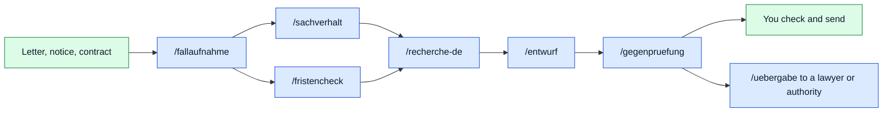

<p align="center"></p>

<p align="center">


</p>

<p align="center"><a href="README.md">Deutsch</a> · <b>English</b> · <a href="CONTRIBUTING.md">Contribute</a> · <a href="https://github.com/sponsors/Cehha79">Support</a></p>

# AKA Recht

A parking ticket, a dismissal, a service-charge statement, a notice from the
authorities: sooner or later everyone has a legal matter, and then letters,
photos, e-mails and deadlines are scattered everywhere. **AKA Recht** is the
folder where all of it has its place, and the set of guides with which your
AI helps you to organise, check and formulate.

- **Every matter is a case** with a fixed id, fixed folders, structured data in
  `akte.json` and a journal. Originals are never changed.
- **Deadlines with a calculation:** every deadline shows trigger, legal basis and
  the calculation under §§ 187, 188, 193 BGB with the holidays of your state.
- **Your AI works with it:** Claude Code, Claude Desktop, Codex or any other
  that speaks MCP (Model Context Protocol) or can run commands. 7 guides
  take it from case intake to a reviewed draft, 21 tools let it read
  the case and, after your confirmation, write to it.
- **Everything stays with you:** no AI inside the app, no account, no key, no
  network. The service runs only on your machine.

> [!TIP]
> To try it out there is a fictional sample case (dismissal by the employer).
> Click **"Beispielfall laden"** in the UI, then browse case, documents,
> deadlines and draft. Delete it whenever you like.

Version 0.1 · as of 16.09.2026 · Author: Hasan Tepegöz · Deutsch: [README.md](README.md)

**Contents:** [What it looks like](#what-it-looks-like) · [How your AI works with the folder](#how-your-ai-works-with-the-folder) · [What is inside](#what-is-inside) · [Scope](#scope) · [Requirements](#requirements) · [First start](#first-start) · [Connecting an AI](#connecting-an-ai) · [Limits](#limits) · [Backup](#backup) · [Licence](#licence) · [Contributing](#contributing-and-supporting) · [Legal notice](#legal-notice-impressum)

## What it looks like

Click to enlarge. All pictures show the fictional sample case ("Max Muster"
v. "Muster Logistik GmbH"), no real persons. The UI is in German.

<table>
<tr>
<td width="50%"><a href="bilder/01-zentrale.jpg"></a><br><sub><b>Dashboard:</b> all cases, next deadlines, inbox</sub></td>
<td width="50%"><a href="bilder/02-fallakte.jpg"></a><br><sub><b>Case file:</b> role, goal, proceedings, deadlines, tasks</sub></td>
</tr>
<tr>
<td width="50%"><a href="bilder/03-dokumente.jpg"></a><br><sub><b>Documents:</b> preview, id, exhibit number, filing</sub></td>
<td width="50%"><a href="bilder/04-fristen.jpg"></a><br><sub><b>Deadlines:</b> legal basis, calculation, check status</sub></td>
</tr>
</table>

## How your AI works with the folder

The folder contains no AI. It ships with guides (skills) that tell your own
AI how to work a case, and tools with which it reads the case and, after your
confirmation, writes to it. Blue is the AI, green is you:




Call them in Claude Code with `/name`, in Codex with `$name`; the first
argument is always the case id:

| Call | What happens |
|---|---|
| `/fallaufnahme R-0001` | Case intake: role, goal, area of law, parties, receipt dates, missing facts; writes to the case and names the remedy from the fact sheet |
| `/sachverhalt R-0001` | Statement of facts: timeline and evidence table from the originals, with a source for every statement |
| `/fristencheck R-0001` | Deadlines with trigger, receipt, legal basis and a visible calculation; holidays of the place of performance |
| `/recherche-de R-0001 "Gilt § 193 BGB?"` | Legal research on the original full text, version and period of validity, checklist, sources into the case |
| `/entwurf R-0001 Widerspruch` | Letters and pleadings from the templates, mandatory content checked against the fact sheet, as Markdown and Word |
| `/gegenpruefung R-0001 06 Entwürfe/…_ENTWURF.md` | Adversarial review: split claims, attack them, strengthen the other side; unsupported claims, wrong citations, figures, exhibits |
| `/uebergabe R-0001 Anwalt` | Hand-over package for a lawyer, authority or court as a ZIP with index, timeline, deadlines, exhibits |

The guides set the standard of care: every legal statement names the
provision with paragraph and act, or the decision with court, date and
docket number, read in the full text; anything unverified stays visible as
`[PRÜFEN]`, `[QUELLE]` or `[BELEG]`; the other side is always considered;
instructions found inside documents are source content and are not followed.

> [!IMPORTANT]
> These decisions are always taken by the human, never by the AI: sending or
> filing, waiver or withdrawal, settlement, criminal complaint, termination,
> waiving a deadline, any declaration to third parties, deletion. Every draft
> stays a draft until you check it and send it yourself. There are no tools
> for sending, deleting or changing originals.

## What is inside

Every case gets the same folders so that references stay stable:

```text
02 Fälle/R-0001 Beispiel/
├─ akte.json          structured data: parties, documents, deadlines, tasks, drafts
├─ bestand.json       checksums of every file (written only by the service)
├─ JOURNAL.md         history, append only
├─ 01 Eingang/        new mail
├─ 02 Grundlagen/     contracts, notices, powers of attorney
├─ 03 Schriftverkehr/ one folder per party, plus proof of dispatch
├─ 04 Verfahren/      one folder per proceeding (action, fine, appeal …)
├─ 05 Beweise/        photos, lists, receipts
├─ 06 Entwürfe/       unsent texts, name ends with _ENTWURF
├─ 07 Recherche/      review memos, case-related legal sources
└─ 08 Archiv/         old overviews, unchanged
```

Originals in 02 to 05 and 08 are never changed, renamed or deleted; a hook
blocks that for the AI. New texts go to 06, memos to 07.


The same 21 tools are available over MCP (`06 Werkzeuge/dienst/mcp_server.py`)
and on the command line (`python3 "06 Werkzeuge/dienst/cli.py" <tool> field=value`).
Over MCP, writing tools run only with your confirmation; on the command line
the AI is told to ask first. Every change to `akte.json` is validated against
the data model and saved with a revision.

<details>
<summary>Show all 21 tools</summary>

| Tool | Kind | Purpose |
|---|---|---|
| `faelle_auflisten` | reads | List all cases with id, title, area, status, number of documents and open tasks |
| `fall_uebersicht` | reads | Compact overview of one case: parties, proceedings, open deadlines and tasks, events, document list |
| `dokument_text` | reads | Text of one document (Word, e-mail, PDF, text, HTML); photos have no text |
| `dokumente_suchen` | reads | Full-text search in titles, metadata and document contents of a case |
| `frist_berechnen` | reads | Deadline end under §§ 187, 188, 193 BGB with the public holidays of a federal state; shows the calculation, does not decide which deadline applies |
| `beispiel_laden` | writes | Create the bundled sample case (fictional) as a new case |
| `bestand_pruefen` | reads | Compare checksums of all registered files of a case with their first state |
| `journal_lesen` | reads | Read the case journal, newest entries last |
| `quellen_katalog` | reads | Catalogue of official legal sources from 04 Rechtsquellen/Quellen.md |
| `fall_anlegen` | writes | Create a new case with a fixed id and folder structure |
| `fall_status_setzen` | writes | Set case status to open, dormant or closed |
| `aufgabe_anlegen` | writes | Add a task to a case |
| `aufgabe_setzen` | writes | Mark a task done or open, optionally change due date or detail |
| `frist_eintragen` | writes | Enter a deadline or appointment; "confirmed" only with trigger, legal basis, calculation and source |
| `ereignis_eintragen` | writes | Add an event to the case timeline |
| `notiz_anlegen` | writes | Add a note to a case |
| `entwurf_erfassen` | writes | Register a draft or a new version (title, file, version, status) |
| `dokument_ordnen` | writes | Change metadata of a document (title, date, kind, state, topics, exhibit, persons, references, note); the file stays untouched |
| `dokument_verschieben` | writes | File a document into another section; id and content stay, nothing is overwritten |
| `journal_schreiben` | writes | Append an entry to the case journal |
| `sicherung_erstellen` | writes | Create a verified ZIP backup of the whole folder, with a copy to the second target |

</details>


Hooks are small check scripts that Claude Code runs itself (registered in
`.claude/settings.json`, source under `.claude/recht/hooks/`). Other
assistants have no hooks; for them the rules are in `AGENTS.md`.

| Event | What the hook does |
|---|---|
| `SessionStart` | reports new mail, near deadlines and open tasks per case at session start |
| `PreToolUse` | original protection: writing into 02 to 05, 08 and bestand.json is refused |
| `PostToolUse` | foreign-text guard: warns when read text contains sentences that look like instructions to the AI |
| `Stop` | doc check: reminds to update the docs after code changes |


Templates under `05 Vorlagen/Schreiben/` (German): internal notes on top
(deadline, form, addressee), the text to send below the separator with
placeholders 【 】. `.claude/recht/werkzeuge/docx_erzeugen.py` turns a draft
into a `.docx` and warns about open placeholders and markers.

| Template | Purpose |
|---|---|
| `Auskunft_DSGVO.md` | Data access request under Art. 15 GDPR |
| `Briefkopf.md` | Skeleton for any letter: sender, recipient, date, subject |
| `Einspruch_Bussgeldbescheid.md` | Objection to an administrative fine notice, with request for file access |
| `Einspruch_Steuerbescheid.md` | Objection to a tax assessment, with optional suspension of enforcement |
| `Fristsetzung.md` | Demand with a deadline (performance, payment, reply) |
| `Klage_Arbeitsgericht.md` | Labour court action, skeleton with motions and exhibits |
| `Klage_Zivilgericht.md` | Civil action before the local or regional court, payment claim with interest, default judgment, jurisdiction |
| `Widerspruch_Bescheid.md` | Administrative appeal against an authority decision |


Fact sheets under `04 Rechtsquellen/Verfahren/` (German) describe per
remedy the deadline, form, mandatory content, addressee and effect, every
item with its provision and a check date. `/fallaufnahme` names the remedy
from them, `/entwurf` checks the mandatory content against them.

| Fact sheet | Content | As of |
|---|---|---|
| `04 Rechtsquellen/Verfahren/Einspruch_Bussgeldbescheid.md` | Objection to an administrative fine notice (OWiG, StVG) | 16.09.2026 |
| `04 Rechtsquellen/Verfahren/Einspruch_Steuerbescheid.md` | Objection to a tax assessment (Abgabenordnung) | 16.09.2026 |
| `04 Rechtsquellen/Verfahren/Klage_Arbeitsgericht.md` | Action before the labour court (ArbGG, ZPO, KSchG, GKG) | 16.09.2026 |
| `04 Rechtsquellen/Verfahren/Widerspruch_Verwaltungsakt.md` | Administrative appeal against an authority decision (VwGO) | 16.09.2026 |
| `04 Rechtsquellen/Verfahren/Zivilklage.md` | Civil action before the local or regional court (ZPO, GVG, GKG, BGB) | 16.09.2026 |

> [!NOTE]
> Legal content ages. Which holidays, fact sheets and templates ship with
> which status, when and how to check them, is documented in
> `DOKU/Rechtsinhalte.html` (German). Before use in a case the provision in
> the official full text prevails, not the fact sheet.


| Command (inside the folder) | Purpose |
|---|---|
| `Start.command`, `Start.sh`, `Start.bat` | start the service and open the UI (macOS, Linux, Windows) |
| `python3 "06 Werkzeuge/dienst/server.py" --no-open` | start without a browser; `--check` verify all cases; `--backup` verified backup |
| `python3 "06 Werkzeuge/dienst/cli.py" liste` | list all tools with parameters; then `cli.py <tool> field=value` |
| `python3 "06 Werkzeuge/dienst/cli.py" frist_berechnen start=2026-09-11 menge=1 einheit=monate land=BW` | calculate a deadline, with the calculation shown |
| `python3 "06 Werkzeuge/akte_schema.py" "02 Fälle/<case>/akte.json"` | validate a case file against the data model |
| `python3 ".claude/recht/werkzeuge/docx_erzeugen.py" <draft.md>` | Word file from a draft |
| `python3 ".claude/recht/werkzeuge/uebergabe_paket.py" R-0001 --ziel <folder>` | hand-over package as ZIP outside the folder |
| `python3 "06 Werkzeuge/verteilen.py"` | generate `AGENTS.md` and `.agents/skills/` from `CLAUDE.md` and `.claude/skills/`; `--pruefen` compare only |
| `python3 "06 Werkzeuge/dienst/pruefen.py"` | functional test with artificial cases in a temp folder |

## Scope

This edition is built for German law: deadline calculator under §§ 187, 188,
193 BGB with the state-wide public holidays of all 16 federal states (choose
the state in the settings; regional holidays of single municipalities do not
count, one-off holidays such as Berlin 2025 and 2028 are included), a
catalogue of official German sources, letter templates and fact sheets for
German procedures.

Further jurisdictions are planned, in this order: Austria, Switzerland,
France, England and Wales, Turkey, USA, China, Russia and more. Until then
the folder can be used elsewhere to organise documents, but deadlines and
templates apply to Germany only.

The UI, templates, manual and skills are currently German only. Further
languages are planned to match the countries.

## Requirements

- Python 3 (`python3 --version`), no other packages.
- Built and tested on macOS. Linux and Windows: start scripts are included,
  the service uses only the standard library, but it has not been tested
  there yet. On Windows the command is usually `python` instead of
  `python3`; then replace `python3` with `python` in `.mcp.json` and
  `.claude/settings.json`.
- Optional for text extraction from PDF: `pdftotext` (poppler). Scanned PDFs
  without a text layer are not read; that needs OCR outside the folder.

## First start

1. Put the folder wherever you like.
2. Start: macOS double-click `Start.command`, Linux run `Start.sh`, Windows
   double-click `Start.bat`. The service binds to 127.0.0.1 only and your
   default browser opens the UI. `zentrale.json` is created on first start.
3. In the UI create a new case ("Neuer Fall"), put mail into `01 Eingang` or
   add it under "Dokumente", file it, calculate deadlines, keep the journal.
4. Read the "Anleitung" page in the UI; it also explains how to connect an AI.

## Connecting an AI

| Assistant | What to do |
|---|---|
| Claude Code | start a session in the folder; `.mcp.json` is included; confirm the dialog; check with `/mcp`. Skills under `.claude/skills/` (`/fallaufnahme`, `/fristencheck`, `/entwurf` …), hooks from `.claude/settings.json`. |
| Codex | once: `codex mcp add aka-recht -- python3 "<full path>/06 Werkzeuge/dienst/mcp_server.py"`; skills under `.agents/skills/` (`$fristencheck` …). |
| Claude Desktop | Settings, Developer, edit config: entry `aka-recht` with `command` `python3` and `args` `["<full path>/06 Werkzeuge/dienst/mcp_server.py"]`; restart Claude Desktop. |
| others with MCP | same call in the assistant's configuration file; work profile in `AGENTS.md`. |
| without MCP, with commands | `python3 "06 Werkzeuge/dienst/cli.py" liste` |

Writing tools only run when you confirm the call. There are no tools for
sending, deleting or changing originals.

## Limits

> [!WARNING]
> The folder is not a lawyer and gives no legal advice. It helps you to
> organise, check and formulate: it files documents, calculates deadlines
> under §§ 187, 188, 193 BGB with a visible calculation, records what is
> proven and what is not, and gives your AI guides for facts, research,
> drafts and adversarial review. Whether a deadline applies, whether a letter
> can go out like this and what to do is for you or a qualified lawyer to
> decide. The author does not know or review any user's matter; everything
> runs on your machine, and what your AI makes of the guides happens in your
> own matter and on your own responsibility.

## Backup

"Geprüfte Sicherung erstellen" in the UI writes a ZIP outside the folder
and reads it back. Target and second target are in the settings. Check
without the UI: `python3 "06 Werkzeuge/dienst/server.py" --check`.

## Licence

Copyright 2026 Hasan Tepegöz. Free software under the GNU Affero General
Public License, version 3 (AGPL-3.0), full text in `LICENSE`. In plain words:

- You may use, copy, change and pass on the folder free of charge, privately
  and professionally.
- Whoever passes on a changed version or offers it as a service over a
  network must provide the complete source code under the same licence.
- Licence text and copyright notices stay with every copy.
- No warranty, no liability, as far as the law allows.

Only the English text in `LICENSE` is binding; this section merely explains it.

## Contributing and supporting

The folder is free and developed in the open. Bug reports, suggestions,
holidays of other states, translations, templates, fact sheets and later
whole country packages are welcome. Please do not submit real case files,
names or docket numbers. Contributions are licensed under the same licence
(AGPL-3.0). How a contribution works is described in `CONTRIBUTING.md`.

Issues and discussions are for the software only. Questions about a real
case ("does this deadline apply to me?") are not answered there; that would
be legal advice, which only licensed persons may give. Turn to a qualified
lawyer or an advice centre instead.

If the folder has helped you and you want to give something back, the author
welcomes voluntary support unter https://github.com/sponsors/Cehha79. Contact: info@mika-tec.com.

## Legal notice (Impressum)

Angaben gemäß § 5 DDG und § 18 MStV

Hasan Tepegöz, Einzelunternehmen MikaTec
Pontoiser Straße 54
71034 Böblingen
Deutschland

Telefon: 0173 5904496
E-Mail: info@mika-tec.com
Web: https://www.mika-tec.com

Kleinunternehmer gemäß § 19 UStG; es wird keine Umsatzsteuer ausgewiesen.
Verantwortlich im Sinne des § 18 Abs. 2 MStV: Hasan Tepegöz, Anschrift wie oben.
