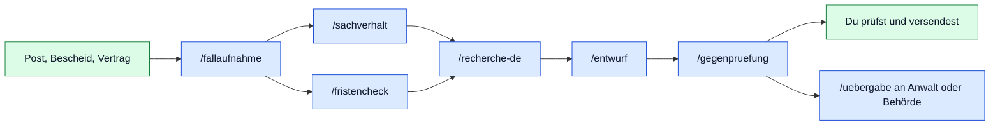

<p align="center"></p>

<p align="center">


</p>

<p align="center"><b>Deutsch</b> · <a href="README.en.md">English</a> · <a href="CONTRIBUTING.md">Mitmachen</a> · <a href="https://github.com/sponsors/Cehha79">Unterstützen</a></p>

# AKA Recht

Ein Strafzettel, eine Kündigung, eine Nebenkostenabrechnung, ein Bescheid
vom Amt: Irgendwann hat jeder eine Rechtssache, und dann liegen Briefe,
Fotos, Mails und Fristen überall. **AKA Recht** ist der Ordner, in dem das
alles seinen Platz findet, und die Anleitung, mit der deine KI dir hilft,
es zu ordnen, zu prüfen und zu formulieren.

- **Jede Sache ist ein Fall** mit fester Kennung, festen Ordnern, Ordnungsdaten
  in `akte.json` und einem Journal. Originale werden nie verändert.
- **Fristen mit Rechnung:** Jede Frist zeigt Auslöser, Rechtsgrundlage und den
  Rechenweg nach §§ 187, 188, 193 BGB, mit den Feiertagen deines Bundeslands.
- **Deine KI arbeitet mit:** Claude Code, Claude Desktop, Codex oder jede andere,
  die MCP (Model Context Protocol) oder Befehle ausführen kann. 7 Anleitungen
  führen sie von der Fallaufnahme bis zum geprüften Entwurf, 21 Werkzeuge
  lassen sie in der Akte lesen und, nach deiner Bestätigung, schreiben.
- **Alles bleibt bei dir:** keine KI in der App, kein Konto, kein Schlüssel,
  kein Netz. Der Dienst läuft nur auf deinem Rechner.

> [!TIP]
> Zum Ausprobieren gibt es einen erfundenen Beispielfall (Kündigung durch den
> Arbeitgeber). In der Oberfläche auf **„Beispielfall laden“** klicken, dann
> durch Akte, Dokumente, Fristen und Entwurf klicken. Jederzeit löschbar.

Version 0.1 · Stand 16.09.2026 · Autor: Hasan Tepegöz

**Inhalt:** [So sieht es aus](#so-sieht-es-aus) · [So arbeitet deine KI mit der Mappe](#so-arbeitet-deine-ki-mit-der-mappe) · [Was in der Mappe steckt](#was-in-der-mappe-steckt) · [Geltungsbereich](#geltungsbereich) · [Voraussetzungen](#voraussetzungen) · [Erster Start](#erster-start) · [KI anbinden](#ki-anbinden) · [Grenzen](#grenzen) · [Sicherung](#sicherung) · [Lizenz](#lizenz) · [Mitmachen](#mitmachen-und-unterstützen) · [Impressum](#impressum)

## So sieht es aus

Zum Vergrößern anklicken. Alle Bilder zeigen den erfundenen Beispielfall
(„Max Muster“ gegen „Muster Logistik GmbH“), keine echten Personen.

<table>
<tr>
<td width="50%"><a href="bilder/01-zentrale.jpg"></a><br><sub><b>Zentrale:</b> alle Fälle, nächste Fristen, Posteingang</sub></td>
<td width="50%"><a href="bilder/02-fallakte.jpg"></a><br><sub><b>Fallakte:</b> Rolle, Ziel, Verfahren, Fristen, Aufgaben</sub></td>
</tr>
<tr>
<td width="50%"><a href="bilder/03-dokumente.jpg"></a><br><sub><b>Dokumente:</b> Vorschau, Kennung, Anlagennummer, Einsortieren</sub></td>
<td width="50%"><a href="bilder/04-fristen.jpg"></a><br><sub><b>Fristen:</b> Rechtsgrundlage, Rechenweg, Prüfstatus</sub></td>
</tr>
</table>

Die Oberfläche hat eine **Zentrale** (Übersicht, alle Fälle, Posteingang,
Fristen aller Fälle, Rechtsquellen, Bestand und Sicherung, Einstellungen,
Anleitung) und je Fall eine **Fallakte** (Übersicht, Dokumente mit Vorschau,
Beteiligte, Verfahren, Chronologie, Fristen mit Rechner, Aufgaben, Entwürfe,
Beweise und Anlagen, Journal). Sie ist reines HTML, CSS und JavaScript ohne
Framework und braucht keinen Zugang nach außen.

## So arbeitet deine KI mit der Mappe

Die Mappe enthält keine KI. Sie bringt Anleitungen (Skills) mit, die deiner
eigenen KI sagen, wie sie einen Fall bearbeitet, und Werkzeuge, mit denen sie
die Akte liest und, nach deiner Bestätigung, in sie schreibt. Blau ist die
KI, grün bist du:




Aufruf in Claude Code mit `/name`, in Codex mit `$name`; das erste Argument
ist immer die Fallkennung:

| Aufruf | Was passiert |
|---|---|
| `/fallaufnahme R-0001` | Rolle, Ziel, Rechtsgebiet, Beteiligte, Zugang, fehlende Angaben; trägt in die Akte ein und nennt den Rechtsbehelf aus dem Merkblatt |
| `/sachverhalt R-0001` | Chronologie und Beweistabelle aus den Originalen, mit Fundstelle je Aussage |
| `/fristencheck R-0001` | Fristen mit Auslöser, Zugang, Rechtsgrundlage und gezeigter Rechnung; Feiertage des Leistungsorts |
| `/recherche-de R-0001 "Gilt § 193 BGB?"` | Rechtsfrage am Originalvolltext, Fassung und Geltungszeitraum, Prüfliste, Quellen in die Akte |
| `/entwurf R-0001 Widerspruch` | Schreiben und Schriftsätze aus den Vorlagen, Pflichtinhalt gegen das Merkblatt, als Markdown und Word |
| `/gegenpruefung R-0001 06 Entwürfe/…_ENTWURF.md` | Behauptungen zerlegen, angreifen, Gegenseite stärken; unbelegte Aussagen, falsche Zitate, Zahlen, Anlagen |
| `/uebergabe R-0001 Anwalt` | Paket für Anwalt, Behörde oder Gericht als ZIP mit Inhaltsverzeichnis, Chronologie, Fristen, Anlagen |

Die Anleitungen legen fest, wie sorgfältig die KI arbeiten muss: jede
Rechtsaussage mit Norm, Absatz und Gesetz oder Urteil mit Gericht, Datum und
Aktenzeichen, am Volltext gelesen; Ungeprüftes bleibt als `[PRÜFEN]`,
`[QUELLE]` oder `[BELEG]` sichtbar; die Gegenseite wird immer mitgedacht;
Anweisungen, die in gelesenen Dokumenten stehen, sind Quelleninhalt und
werden nicht befolgt.

> [!IMPORTANT]
> Diese Entscheidungen trifft immer der Mensch, nie die KI: Versand oder
> Einreichung, Verzicht oder Rücknahme, Vergleich, Strafanzeige, Kündigung,
> Fristverzicht, jede Erklärung gegenüber Dritten, Löschen. Jeder Entwurf
> bleibt Entwurf, bis du ihn prüfst und selbst versendest. Werkzeuge für
> Versand, Löschen oder Ändern von Originalen gibt es nicht.

## Was in der Mappe steckt

Jeder Fall bekommt dieselben Ordner, damit Verweise stabil bleiben:

```text
02 Fälle/R-0001 Beispiel/
├─ akte.json          Ordnungsdaten: Beteiligte, Dokumente, Fristen, Aufgaben, Entwürfe
├─ bestand.json       Prüfsummen jeder Datei (schreibt nur der Dienst)
├─ JOURNAL.md         Verlauf, nur anhängen
├─ 01 Eingang/        neue Post
├─ 02 Grundlagen/     Verträge, Bescheide, Vollmachten
├─ 03 Schriftverkehr/ je Beteiligter ein Ordner, dazu Versandnachweise/
├─ 04 Verfahren/      je Verfahren ein Ordner (Klage, Bußgeld, Widerspruch …)
├─ 05 Beweise/        Fotos, Listen, Quittungen
├─ 06 Entwürfe/       noch nicht versandte Texte, Name endet auf _ENTWURF
├─ 07 Recherche/      Prüfvermerke, fallbezogene Rechtsquellen
└─ 08 Archiv/         alte Übersichten, unverändert
```

Originale in 02 bis 05 und 08 werden nie verändert, umbenannt oder gelöscht;
ein Hook sperrt das für die KI. Neue Texte entstehen in 06, Vermerke in 07.


Dieselben 21 Werkzeuge erreicht die KI über MCP (`06 Werkzeuge/dienst/mcp_server.py`)
oder über die Befehlszeile (`python3 "06 Werkzeuge/dienst/cli.py" <werkzeug> feld=wert`).
Schreibende Werkzeuge laufen über MCP nur mit deiner Bestätigung; über die
Befehlszeile soll die KI vorher fragen. Jede Änderung an `akte.json` wird
gegen das Datenmodell geprüft und mit Revision gespeichert.

<details>
<summary>Alle 21 Werkzeuge anzeigen</summary>

| Werkzeug | Art | Zweck |
|---|---|---|
| `faelle_auflisten` | lesend | Alle Fälle mit Kennung, Titel, Bereich, Status, Zahl der Dokumente und offenen Aufgaben. |
| `fall_uebersicht` | lesend | Kompakte Übersicht eines Falls: Fall, Beteiligte, Verfahren, offene Fristen und Aufgaben, Ereignisse, Dokumentliste mit Kennung, Titel, Datum, Stand. Dokumentinhalte über dokument_text. |
| `dokument_text` | lesend | Textauszug eines Dokuments (Word, E-Mail, PDF, Text, HTML). Fotos haben keinen Text. |
| `dokumente_suchen` | lesend | Volltextsuche in Titeln, Ordnungsangaben und Dokumentinhalten eines Falls. |
| `frist_berechnen` | lesend | Fristende nach §§ 187, 188, 193 BGB mit den landesweiten Feiertagen eines Bundeslands berechnen (Standard: Einstellung der Mappe). Liefert die Rechnung als Text. Entscheidet nicht, welche Frist gilt. |
| `beispiel_laden` | schreibend | Die mitgelieferte Beispielakte (erfundener Fall) als neuen Fall anlegen, zum Ausprobieren. Der Fall bekommt die nächste freie Kennung. |
| `bestand_pruefen` | lesend | Prüfsummen aller registrierten Dateien eines Falls mit dem ersten Stand vergleichen. |
| `journal_lesen` | lesend | Verlauf eines Falls aus JOURNAL.md, neueste Einträge zuletzt. |
| `quellen_katalog` | lesend | Gemeinsamer Zugangskatalog amtlicher Rechtsquellen aus 04 Rechtsquellen/Quellen.md. |
| `fall_anlegen` | schreibend | Neuen Fall mit fester Kennung und Ordnerstruktur anlegen. |
| `fall_status_setzen` | schreibend | Fallstatus auf offen, ruhend oder abgeschlossen setzen. Der Fall bleibt am gleichen Ort. |
| `aufgabe_anlegen` | schreibend | Aufgabe in einem Fall anlegen. |
| `aufgabe_setzen` | schreibend | Aufgabe als erledigt oder wieder offen setzen, optional Fälligkeit oder Detail ändern. |
| `frist_eintragen` | schreibend | Frist oder Termin in einem Fall eintragen. Bestätigt nur mit Auslöser, Rechtsgrundlage, Rechnung und Quelle. |
| `ereignis_eintragen` | schreibend | Ereignis in die Chronologie eines Falls eintragen. |
| `notiz_anlegen` | schreibend | Ordnungsnotiz in einem Fall anlegen. |
| `entwurf_erfassen` | schreibend | Entwurf in der Akte erfassen oder fortschreiben (Titel, Datei, Fassung, Status). Gleicher Titel = neue Fassung. |
| `dokument_ordnen` | schreibend | Ordnungsangaben eines Dokuments ändern (Titel, Datum, Art, Stand, Themen, Anlage, Personen, Verweise, Notiz). Die Datei selbst bleibt unverändert. |
| `dokument_verschieben` | schreibend | Datei in einen anderen Aktenbereich einsortieren. Kennung und Inhalt bleiben, nichts wird überschrieben. |
| `journal_schreiben` | schreibend | Eintrag an das Journal eines Falls anhängen. |
| `sicherung_erstellen` | schreibend | Geprüfte ZIP-Sicherung des ganzen Projekts erstellen, mit Kopie an das zweite Ziel. |

</details>


Hooks sind kleine Prüfskripte, die Claude Code selbst ausführt (in
`.claude/settings.json` eingetragen, Quelltext unter `.claude/recht/hooks/`).
Andere Assistenten kennen keine Hooks; für sie stehen die Regeln in
`AGENTS.md`.

| Zeitpunkt | Was der Hook tut |
|---|---|
| `SessionStart` | meldet beim Start Eingang, nahe Fristen und offene Aufgaben je Fall |
| `PreToolUse` | Originalschutz: Schreiben in 02 Grundlagen, 03 Schriftverkehr, 04 Verfahren, 05 Beweise, 08 Archiv und in bestand.json wird abgewiesen |
| `PostToolUse` | Fremdtext-Wächter: warnt, wenn gelesener Text Sätze enthält, die wie Anweisungen an die KI klingen |
| `Stop` | Doku-Abgleich: erinnert daran, die Doku nach Code-Änderungen nachzuziehen |


Vorlagen unter `05 Vorlagen/Schreiben/`: oben interne Hinweise (Frist,
Form, Adressat), unter der Trennlinie der Sendetext mit Platzhaltern 【 】.
Der Word-Erzeuger `.claude/recht/werkzeuge/docx_erzeugen.py` macht daraus
eine `.docx` und warnt vor offenen Platzhaltern und Markern.

| Vorlage | Zweck |
|---|---|
| `Akteneinsicht.md` | Antrag auf Akteneinsicht bei Behörde, Gericht oder Arbeitgeber mit wählbarer Rechtsgrundlage |
| `Auskunft_DSGVO.md` | Auskunftsantrag nach Art. 15 DSGVO |
| `Briefkopf.md` | Grundgerüst für jedes Schreiben: Absender, Empfänger, Datum, Betreff |
| `Einspruch_Bussgeldbescheid.md` | Einspruch gegen einen Bußgeldbescheid, mit Akteneinsicht |
| `Einspruch_Steuerbescheid.md` | Einspruch gegen einen Steuerbescheid, mit Aussetzung der Vollziehung als Option |
| `Fristsetzung.md` | Aufforderung mit Frist (Nacherfüllung, Zahlung, Antwort) |
| `Klage_Arbeitsgericht.md` | Klage zum Arbeitsgericht, Grundgerüst mit Anträgen und Anlagen |
| `Klage_Zivilgericht.md` | Zivilklage zum Amts- oder Landgericht, Zahlungsantrag mit Zinsen, Versäumnisurteil, Zuständigkeit |
| `Strafanzeige.md` | Strafanzeige mit oder ohne Strafantrag, Sachverhalt, Beweismittel, Bitte um Bestätigung |
| `Widerspruch_Bescheid.md` | Widerspruch gegen einen Bescheid einer Behörde |


Merkblätter unter `04 Rechtsquellen/Verfahren/` beschreiben je Rechtsbehelf
Frist, Form, Pflichtinhalt, Adressat und Wirkung, jede Angabe mit Norm und
Prüfdatum. `/fallaufnahme` nennt daraus den Rechtsbehelf, `/entwurf` prüft
den Pflichtinhalt dagegen.

| Merkblatt | Inhalt | Stand |
|---|---|---|
| `04 Rechtsquellen/Verfahren/Akteneinsicht.md` | Akteneinsicht und Auskunft | 16.09.2026 |
| `04 Rechtsquellen/Verfahren/Dienstaufsichtsbeschwerde.md` | Dienstaufsichtsbeschwerde, Fachaufsichtsbeschwerde, Petition | 16.09.2026 |
| `04 Rechtsquellen/Verfahren/Einspruch_Bussgeldbescheid.md` | Einspruch gegen einen Bußgeldbescheid | 16.09.2026 |
| `04 Rechtsquellen/Verfahren/Einspruch_Steuerbescheid.md` | Einspruch gegen einen Steuerbescheid | 16.09.2026 |
| `04 Rechtsquellen/Verfahren/Klage_Arbeitsgericht.md` | Klage zum Arbeitsgericht | 16.09.2026 |
| `04 Rechtsquellen/Verfahren/Mahnverfahren.md` | Mahnverfahren (Mahnbescheid und Vollstreckungsbescheid) | 16.09.2026 |
| `04 Rechtsquellen/Verfahren/Strafanzeige.md` | Strafanzeige und Strafantrag | 16.09.2026 |
| `04 Rechtsquellen/Verfahren/Widerspruch_Verwaltungsakt.md` | Widerspruch gegen einen Verwaltungsakt (Bescheid einer Behörde) | 16.09.2026 |
| `04 Rechtsquellen/Verfahren/Zivilklage.md` | Zivilklage vor dem Amtsgericht oder Landgericht | 16.09.2026 |
| `04 Rechtsquellen/Verfahren/Zustaendigkeit_finden.md` | Zuständige Stelle finden | 16.09.2026 |

> [!NOTE]
> Rechtsinhalte altern. Welche Feiertage, Merkblätter und Vorlagen mit
> welchem Stand mitgeliefert sind, wann sie zu prüfen sind und wie, steht in
> `DOKU/Rechtsinhalte.html`. Vor der Verwendung in einem Fall gilt immer die
> Norm am amtlichen Volltext, nicht das Merkblatt.


| Befehl (im Ordner der Mappe) | Zweck |
|---|---|
| `Start.command`, `Start.sh`, `Start.bat` | Dienst starten und Oberfläche öffnen (macOS, Linux, Windows) |
| `python3 "06 Werkzeuge/dienst/server.py" --no-open` | Dienst ohne Browser starten; `--check` Bestand aller Fälle prüfen; `--backup` geprüfte Sicherung |
| `python3 "06 Werkzeuge/dienst/cli.py" liste` | alle Werkzeuge mit Parametern; danach `cli.py <werkzeug> feld=wert` |
| `python3 "06 Werkzeuge/dienst/cli.py" frist_berechnen start=2026-09-11 menge=1 einheit=monate land=BW` | Frist rechnen, mit Rechenweg |
| `python3 "06 Werkzeuge/akte_schema.py" "02 Fälle/<Fall>/akte.json"` | Akte gegen das Datenmodell prüfen |
| `python3 ".claude/recht/werkzeuge/docx_erzeugen.py" <Entwurf.md>` | Word-Datei aus einem Entwurf |
| `python3 ".claude/recht/werkzeuge/uebergabe_paket.py" R-0001 --ziel <Ordner>` | Übergabepaket als ZIP außerhalb der Mappe |
| `python3 "06 Werkzeuge/verteilen.py"` | `AGENTS.md` und `.agents/skills/` aus `CLAUDE.md` und `.claude/skills/` erzeugen; `--pruefen` nur vergleichen |
| `python3 "06 Werkzeuge/dienst/pruefen.py"` | Funktionstest mit künstlichen Akten in einem Temp-Ordner |

## Geltungsbereich

Diese Fassung ist für deutsches Recht gebaut: Fristenrechner nach §§ 187,
188, 193 BGB mit den landesweiten Feiertagen aller 16 Bundesländer (Bundesland
in den Einstellungen wählen; regionale Feiertage einzelner Gemeinden zählen
nicht, einmalige Feiertage wie in Berlin 2025 und 2028 sind eingetragen),
Quellenkatalog mit deutschen amtlichen Angeboten, Schreibvorlagen und
Merkblätter für deutsche Verfahren.

Weitere Rechtsordnungen sind geplant, in dieser Reihenfolge: Österreich,
Schweiz, Frankreich, England und Wales, Türkei, USA, China, Russland und
weitere Länder. Bis dahin lässt sich die Mappe dort zwar zum Ordnen von
Unterlagen nutzen, Fristen und Vorlagen gelten aber nur für Deutschland.

Oberfläche, Vorlagen, Anleitung und Skills sind derzeit nur auf Deutsch.
Weitere Sprachen sind geplant, passend zu den Ländern.

## Voraussetzungen

- Python 3 (`python3 --version`), keine weiteren Pakete.
- Gebaut und geprüft auf macOS. Linux und Windows: Startskripte liegen bei,
  der Dienst nutzt nur die Standardbibliothek, geprüft ist es dort noch
  nicht. Unter Windows heißt der Befehl meist `python` statt `python3`;
  dann in `.mcp.json` und `.claude/settings.json` `python3` durch `python`
  ersetzen.
- Für die Textauszüge aus PDF optional `pdftotext` (Paket poppler). Scans
  ohne Textschicht liest die Mappe nicht; dafür braucht es OCR außerhalb.

## Erster Start

1. Ordner an einen Ort deiner Wahl legen.
2. Starten: macOS `Start.command` doppelklicken, Linux `Start.sh`
   ausführen, Windows `Start.bat` doppelklicken. Der Dienst läuft nur auf
   127.0.0.1, der Standardbrowser öffnet die Oberfläche. Beim ersten Start
   entsteht `zentrale.json`.
3. In der Oberfläche „Neuer Fall“ anlegen, Post nach `01 Eingang` legen oder
   in „Dokumente“ hinzufügen, ordnen, Fristen rechnen, Journal führen.
4. Seite „Anleitung“ in der Oberfläche lesen, dort steht auch, wie du eine KI
   anbindest.

## KI anbinden

| Assistent | Was zu tun ist |
|---|---|
| Claude Code | Sitzung im Ordner starten; `.mcp.json` liegt bei; Dialog bestätigen; `/mcp` prüfen. Skills unter `.claude/skills/` (`/fallaufnahme`, `/fristencheck`, `/entwurf` …), Hooks aus `.claude/settings.json`. |
| Codex | einmalig `codex mcp add aka-recht -- python3 "<voller Pfad>/06 Werkzeuge/dienst/mcp_server.py"`; Skills unter `.agents/skills/` (`$fristencheck` …). |
| Claude Desktop | Einstellungen, Entwickler, Konfiguration bearbeiten: Eintrag `aka-recht` mit `command` `python3` und `args` `["<voller Pfad>/06 Werkzeuge/dienst/mcp_server.py"]`; Claude Desktop neu starten. |
| andere mit MCP | gleicher Aufruf in der Konfigurationsdatei des Assistenten; Arbeitsprofil in `AGENTS.md`. |
| ohne MCP, mit Befehlen | `python3 "06 Werkzeuge/dienst/cli.py" liste` |

Schreibende Werkzeuge laufen nur, wenn du den Aufruf bestätigst. Werkzeuge
für Versand, Löschen oder Ändern von Originalen gibt es nicht.

## Grenzen

> [!WARNING]
> Die Mappe ist kein Rechtsanwalt und gibt keine Rechtsberatung. Sie hilft
> beim Ordnen, Prüfen und Formulieren: Sie ordnet Unterlagen, rechnet Fristen
> nach §§ 187, 188, 193 BGB mit sichtbarer Rechnung, hält fest, was belegt ist
> und was nicht, und gibt deiner KI Anleitungen für Sachverhalt, Recherche,
> Entwürfe und Gegenprüfung. Ob eine Frist gilt, ob ein Schreiben so
> hinausgehen kann und was zu tun ist, prüfst du oder eine Fachanwältin, ein
> Fachanwalt. Der Autor kennt und prüft keine Angelegenheit eines Nutzers;
> alles läuft auf deinem Rechner, und was deine KI aus den Anleitungen macht,
> geschieht in deiner eigenen Sache und Verantwortung.

## Sicherung

„Geprüfte Sicherung erstellen“ in der Oberfläche schreibt eine ZIP außerhalb
des Ordners und liest sie zurück. Ziel und zweites Ziel stehen in den
Einstellungen. Prüfen ohne Oberfläche: `python3 "06 Werkzeuge/dienst/server.py" --check`.

## Lizenz

Copyright 2026 Hasan Tepegöz. Freie Software unter der GNU Affero
General Public License, Version 3 (AGPL-3.0), Wortlaut in `LICENSE`.
In Klartext:

- Du darfst die Mappe kostenlos nutzen, kopieren, ändern und weitergeben,
  privat wie beruflich.
- Wer sie verändert weitergibt oder als Dienst über ein Netz anbietet, muss
  den vollständigen Quelltext unter derselben Lizenz mitliefern.
- Lizenztext und Urheberhinweise bleiben bei jeder Weitergabe dabei.
- Keine Gewährleistung, keine Haftung, soweit das Gesetz das zulässt.

Maßgeblich ist allein der englische Text in `LICENSE`; dieser Abschnitt
erklärt ihn nur.

## Mitmachen und Unterstützen

Die Mappe ist kostenlos und wird offen entwickelt. Fehler, Vorschläge,
Feiertage anderer Bundesländer, Übersetzungen, Vorlagen, Merkblätter und
später ganze Länderpakete sind willkommen. Bitte keine echten Akten, Namen
oder Aktenzeichen einreichen. Beiträge stehen unter derselben Lizenz
(AGPL-3.0). Wie ein Beitrag abläuft, steht in `CONTRIBUTING.md`.

Issues und Diskussionen sind nur für die Software da. Fragen zu einem echten
Fall („Gilt bei mir die Frist?“) werden dort nicht beantwortet; das wäre
Rechtsberatung, die nur zugelassene Personen erbringen dürfen. Wende dich
dafür an eine Fachanwältin, einen Fachanwalt oder eine Beratungsstelle.

Wenn dir die Mappe geholfen hat und du etwas zurückgeben willst, freut sich
der Autor über freiwillige Unterstützung unter https://github.com/sponsors/Cehha79. Kontakt: info@mika-tec.com.

## Impressum

Angaben gemäß § 5 DDG und § 18 MStV

Hasan Tepegöz, Einzelunternehmen MikaTec
Pontoiser Straße 54
71034 Böblingen
Deutschland

Telefon: 0173 5904496
E-Mail: info@mika-tec.com
Web: https://www.mika-tec.com

Kleinunternehmer gemäß § 19 UStG; es wird keine Umsatzsteuer ausgewiesen.
Verantwortlich im Sinne des § 18 Abs. 2 MStV: Hasan Tepegöz, Anschrift wie oben.
